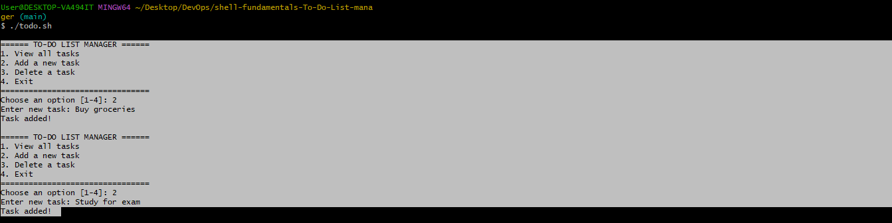

# 📝 Simple Interactive To-Do List manager: Application of Shell fundamentals

## 📌 Objective

This is a **simple interactive To-Do List Manager** using **Bash scripting**, which I built that runs in the terminal. It allows the user to **add**, **view**, and **delete tasks** using the terminal and storing them in a file ` ~/todo.txt` within the user's home directory.

---

## 🛠️ Technologies I Used
- Bash Shell

- echo, read, sed, nl

- File: ~/todo.txt

## 📦 Project Structure
``` bash

shell-fundamentals-To-Do-List-manager/
├── todo.sh
├── README.md
└── screenshots/
    ├── menu.png
    ├── add-task.png
    ├── view-tasks.png
    ├── delete-task.png
    └── exit.png
```


---

## 📝 Tasks Overview

## 📁 Repository Setup

### Step 1: 
I created a new GitHub repository named `shell-fundamentals-To-Do-List-manager` and cloned the repository locally for this project to document and track progress. It contains a `README.md` file for detailed task descriptions and a `screenshots/` folder for all required visuals. Then pushed this to GitHub after completing the script and adding screenshots.

``` bash
git clone https://github.com/dWanderingSoul/shell-fundamentals-To-Do-List-manager.git
cd shell-fundamentals-To-Do-List-manager
touch README.md
```

### 🛠️ These are the Task Requirements
- Create a Bash script named `todo.sh`.

- Display an interactive menu:

  - 📋 View all tasks

  - ➕ Add a new task

  - ❌ Delete a task

  - 🚪 Exit the program

- Tasks are stored in a file at: ~/todo.txt
- User input is gotten using `read`.
- Tasks are numbered using the `nl` command.
- Tasks are appended to the file using  `echo`.
- Delete tasks by selecting their line number using `sed -i`.
- Keep running in a loop until the user exits

### Step 2: 📜 Creating a Script File 

 I created the Script File named `todo.sh`and made it executable. Then opened the file using the following command in git bash:
 
``` bash
touch todo.sh
chmod +x todo.sh
nano todo.sh
```

Added the following code to the script file 


``` bash
#!/bin/bash

TODO_FILE=~/todo.txt

# Create the todo file if it doesn't exist
touch "$TODO_FILE"

# Function to show the main menu
show_menu() {
  echo ""
  echo "====== TO-DO LIST MANAGER ======"
  echo "1. View all tasks"
  echo "2. Add a new task"
  echo "3. Delete a task"
  echo "4. Exit"
  echo "================================"
  echo -n "Choose an option [1-4]: "
}

# Function to view tasks
view_tasks() {
  echo ""
  echo "====== Your Tasks ======"
  if [[ ! -s "$TODO_FILE" ]]; then
    echo "No tasks found."
  else
    nl "$TODO_FILE"
  fi
}

# Function to add a new task
add_task() {
  echo -n "Enter new task: "
  read task
  echo "$task" >> "$TODO_FILE"
  echo "Task added!"
}

# Function to delete a task by number
delete_task() {
  view_tasks
  echo -n "Enter task number to delete: "
  read task_num
  if [[ $task_num =~ ^[0-9]+$ ]]; then
    sed -i "${task_num}d" "$TODO_FILE"
    echo "Task deleted."
  else
    echo "Invalid task number."
  fi
}

# Main loop that keeps the script running
while true; do
  show_menu
  read choice
  case $choice in
    1) view_tasks ;;
    2) add_task ;;
    3) delete_task ;;
    4) echo "Goodbye!"; exit 0 ;;
    *) echo "Invalid choice. Please choose 1-4." ;;
  esac
done
```
This code will successfully carry out the task requirements as mentioned above. To run the Script using the command `./todo.sh`. The script displays a menu, responds based on input and  keeps on running until I exit.

## 🖼️ Screenshots & Descriptions

I created a folder called `screenshots/` and saved terminal screenshots to visually demonstrate each feature.
``` bash
mkdir screenshots
```
### 1. Script Menu Display Interface

📸 Screenshot 1


- Description of what is done here
When the script is executed, it presents the user with a simple menu displaying four options: View tasks, Add task, Delete task, and Exit. The program waits for the user's input via the `read` command and loops until "Exit" is selected.

### 2. Adding a Task

📸 Screenshot 2



- Description of what is done here
Upon choosing the "Add" option (2), the user is prompted to enter a task. The entered text is appended via `echo` to `~/todo.txt`. This ensures tasks persist even after the script is closed.

### 3. Viewing All Tasks

📸 Screenshot 3


- Description of what is done here
Selecting option (1) shows the current tasks stored in the `todo.txt` file. The `nl` (number lines) command is used to display task numbers alongside each task, making them easy to reference for deletion.

### 4. Viewing All Tasks

📸 Screenshot 4


- Description of what is done here
Choosing option (3) prompts the user to enter the task number (as shown via `nl`). The `sed -i` command is then used to delete the task at the specified line number from the file. The list updates accordingly.


### 5. Exiting the Script

📸 Screenshot 5


   
- Description of what is done here
Choosing option 4 terminates the loop and exits the script gracefully with a friendly message.

## 🧠 Key Commands Used

| Command    | Purpose                                  |
| ---------- | ---------------------------------------- |
| `read`     | To capture user input                    |
| `echo`     | To display messages or write to file     |
| `nl`       | To show line numbers with tasks          |
| `sed -i`   | To delete a specific line from the file  |
| `chmod +x` | To make the script executable            |
| `touch`    | To create a new file if it doesn’t exist |

## 🚀 Pushing to GitHub
After adding the script and screenshots:

```bash
git add .
git commit -m 
git push origin main
```
---

## 📌 Final Notes
> This project helped me practice real-world Bash scripting.

> I learned how to use loops, file handling, and command-line tools like nl, read, echo, and sed.

> The tasks are persistent in ~/todo.txt

> The script keeps looping until I exit

> This was a great way for me to practice control flow, file manipulation, and user interaction in Bash

> It was a fun and practical way to understand shell scripting basics!
